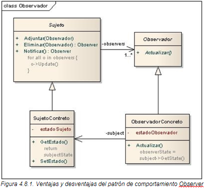

# Patrón de Diseño: <Nombre_del_patron>
Este proyecto demuestra la implementación del patrón de diseño **<Nombre_del_patron>**. El patrón ....

## Objetivo
<Breve_descripción_de_objetivo>. Este patrón permite:

- <objetivo_1>
- <objetivo_2>
- <objetivo_n>

## Diagrama de clases


## Estructura
1. **<elemento1>**: <descripcion1>.
2. **<elemento2>**: <descripcion2>.
n. **<elementon>**: <descripcionn>.

## Ejecución
Para ejecutar el proyecto, asegúrate de tener configurado Maven y ejecuta los siguientes comandos:
```bash
    mvn clean install
    mvn exec:java
